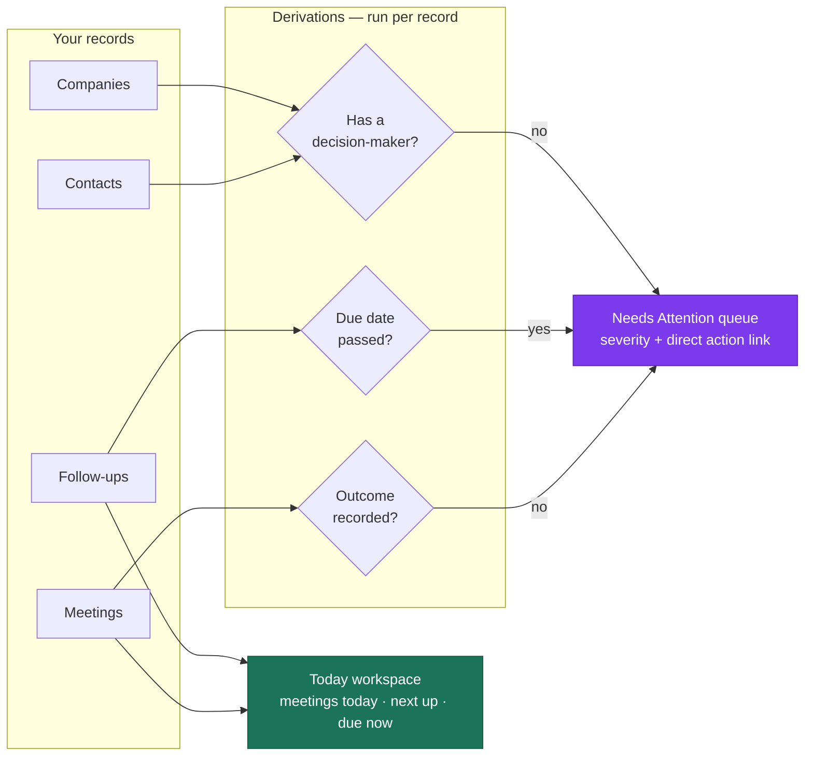
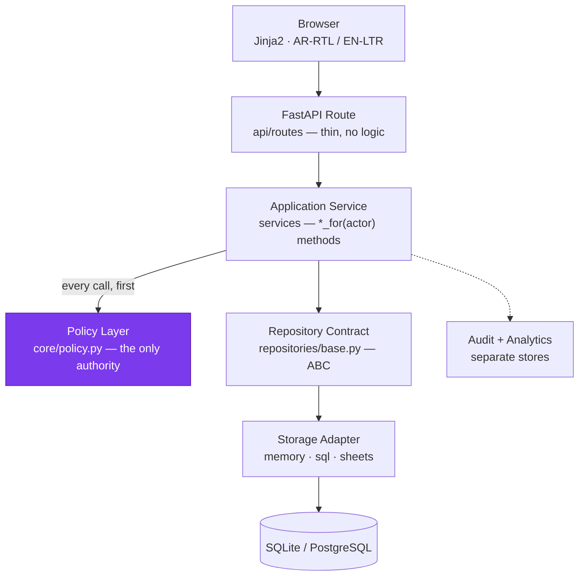
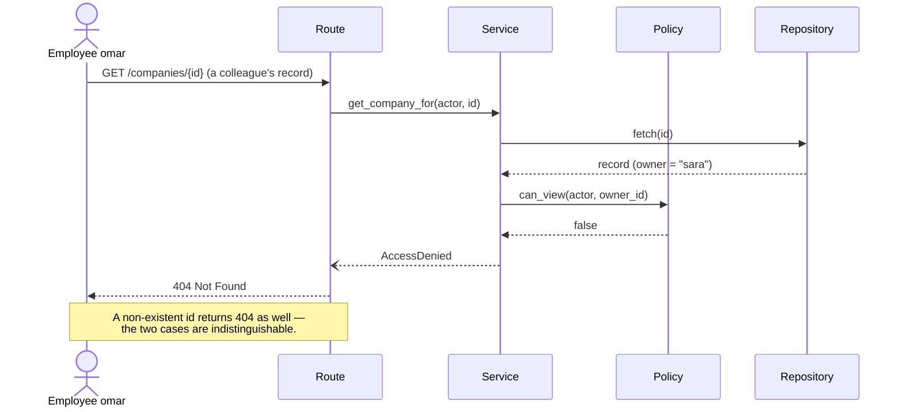
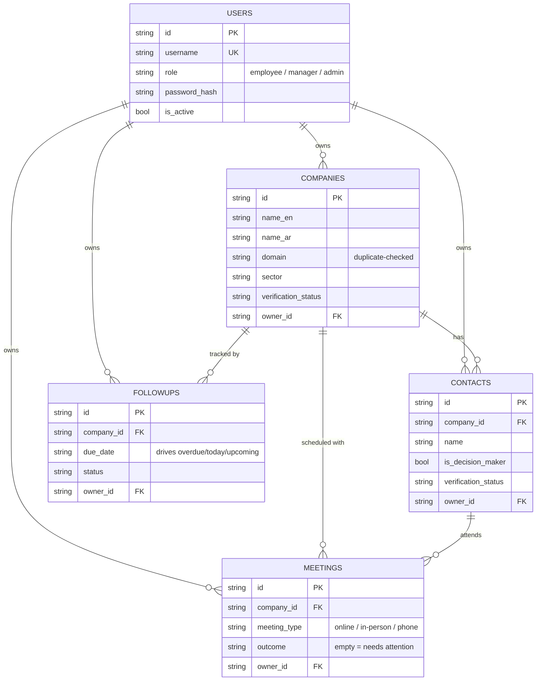

<div align="center">

# 🌿 GreenLead

### A bilingual Business-Development & Sales-Intelligence operating system

**نظام تشغيل ثنائي اللغة لتطوير الأعمال وذكاء المبيعات**

*Know exactly what to do today — every company, contact, follow-up and meeting in one place, in Arabic or English.*

[](https://github.com/bahaaed07706/GreenLead/actions/workflows/ci.yml)


*The CI badge is live — it reflects the latest run of lint, type-check and the full test suite on Python 3.11 & 3.12. Coverage is enforced in that same run by a `--cov-fail-under=80` gate.*

## [▶ Open the live demo](https://greenlead-demo.onrender.com)

**No installation. Sign in and start clicking.**

| Username | Password | Role | What you'll see |
|---|---|---|---|
| `admin` | `Admin@123` | Admin | Everything, plus user management and the audit log |
| `manager` | `Manager@123` | Manager | All records across the team; can reassign owners |
| `sara` | `Sara@123` | Employee | Only her own records |
| `omar` | `Omar@123` | Employee | Only his own records |

Sign in as **`sara`**, then as **`omar`**: each sees a different slice of the same
database. That is record-level authorization working, not a mock-up.

<sub>Hosted on a free instance that sleeps after ~15 minutes idle — the first
request may take 30–50 seconds to wake it. The demo re-seeds itself on every
boot, so it always starts clean and keeps no visitor data. These credentials are
public on purpose; they exist only on this throwaway demo.</sub>

[](https://render.com/deploy?repo=https://github.com/bahaaed07706/GreenLead)

*Or deploy your own copy in two minutes — the button reads [`render.yaml`](render.yaml) and configures everything.*

</div>

---

## 🎯 What is GreenLead?

GreenLead is a **CRM + sales-intelligence platform** for business-development and sales teams. It replaces scattered spreadsheets with one focused workspace that answers a single question first: **"What do I need to do today?"**

It ships **white-label**: your organization name, industry and default sector are configuration values rather than hardcoded strings, so you can adapt it to your own company, role or market without editing code — see **[docs/CUSTOMIZATION.md](docs/CUSTOMIZATION.md)**.

Instead of a generic admin dashboard, it surfaces **actionable work** — companies missing a decision-maker, overdue follow-ups, meetings without a recorded outcome — and links each item straight to the fix.

Most CRMs answer *"how many?"*. This one answers *"what now?"* — every record is
run through a set of derivations, and anything that fails one becomes a queue
item with a severity and a link to the screen that resolves it:



The derivations are deterministic and injectable (the dashboard clock is a
parameter), which is why they are covered by tests rather than eyeballed.

> **Honesty note:** this is an actively-developed product, not a finished commercial release. The status of every capability is stated transparently below — nothing is claimed "done" unless it is implemented **and** tested.

## 👥 Who is it for?

| Role | What they get |
|---|---|
| **Business-Development Rep / AE** | Their own companies, contacts, follow-ups, meetings; a "Today" workspace and an actionable "Needs Attention" queue. |
| **Sales Manager** | Team-wide visibility, record reassignment, pipeline & data-quality oversight *(reporting UI in progress)*. |
| **Admin** | User & role management, the security audit log, integration status. |

Designed **Arabic-first** (native RTL) with a fully equivalent **English (LTR)** experience.

---

## ✅ Feature status (transparent)

Legend: ✅ implemented & tested · 🟡 partial · 🔭 planned · 🔒 architecture ready, needs your credentials to go live

### Implemented & tested
- ✅ **Bilingual UI** — Arabic RTL / English LTR, persistent language, LTR-isolation for emails/domains/URLs/dates
- ✅ **Authentication** — multi-user accounts, **roles** (employee / manager / admin), signed session cookies, login rate-limiting
- ✅ **Record-level authorization** — employees see only their own records; managers/admins see all and can reassign; **IDOR-protected** (missing and forbidden both return `404`, no id enumeration)
- ✅ **Audit log** — append-only, admin-only viewer with filters; secrets are redacted, never stored
- ✅ **Product analytics** — provider-independent internal event store (separate from the audit trail)
- ✅ **Companies** — create / view / edit / search (name · Arabic name · domain), duplicate-domain detection
- ✅ **Contacts** — CRUD, decision-maker flag, verification status, source URL
- ✅ **Follow-ups** — full lifecycle; deterministic overdue / due-today / upcoming derivations
- ✅ **Meetings** — online / in-person / phone, validation (end > start, URL/location rules), outcomes, **`.ics` calendar export**
- ✅ **Dashboard** — a **"Today"** workspace (meetings today, next meeting, due/overdue follow-ups) and a record-level **"Needs Attention"** work queue with severities and direct actions
- ✅ **Persistence** — SQLAlchemy ORM + **Alembic migrations**; data survives restart

### In progress / planned
- 🟡 **Manager view & reports** — team workload and pipeline reporting UI
- 🔭 **Activities timeline** · **Opportunities & pipeline** · **Company 360** view
- 🔭 **Global search** across all entities
- 🔭 **First-run onboarding** flow · **CSV/Excel import-export** · **backup/restore** scripts
- 🔭 **Teams** — today "team" means all users; a Team entity is planned (isolated behind the policy layer)

### Credential-gated / not live
- 🔒 **Google Sheets** storage adapter (Companies & Contacts) — needs a service-account key
- 🔒 **Tavily** web-research provider — ships with a deterministic **mock**; needs an API key to go live
- 🔒 **AI provider** (OpenAI / Gemini) — status wiring is config-aware; research agent & AI assistant are **specified, not yet built**
- 🔒 **PostgreSQL** — schema & migrations are Postgres-ready; verified on SQLite, not yet against a live Postgres server

---

## 🏗️ Architecture

Clean, layered, and boring on purpose — every request flows one way, and authorization lives in exactly one place.



Every permission decision in the system passes through the purple node. There is
no second path — that is what makes the authorization auditable.

### How a request is authorized

The interesting case is a user reaching for a record that is not theirs. A
forbidden record and a record that does not exist produce the **same** response,
so ids cannot be probed:



### Data model



Every record carries an `owner_id`. That single column is what the policy layer
reads, and it is why record-level scoping works identically across all four
entities.

**Principles**
- **Routes are thin** — no SQL, no business rules, no permission decisions in templates.
- **Authorization is centralized** in `core/policy.py`; services expose `*_for(actor, …)` methods and routes call *only* those.
- **Storage is swappable** behind repository contracts (in-memory for tests, SQL for prod, Sheets as an optional adapter) — services never change.
- **Audit ≠ analytics** — "who changed what" (security) is a different store from "how is the product used" (product events).

### Layout
```
src/greenlead/
├── api/routes/        # FastAPI routers (auth, dashboard, companies, contacts,
│                      #   followups, meetings, admin, audit) — thin
├── services/          # business logic + authorized *_for() methods
├── repositories/      # contracts (base) + adapters (memory, sql, sheets)
├── core/              # policy (authz), security, config, i18n, logging
└── models/            # Pydantic domain schemas
templates/             # Jinja2 (shared _sidebar partial, bilingual)
migrations/            # Alembic revisions
tests/                 # 144 tests (unit, route, IDOR, audit, migrations)
```

---

## 🧰 Tech stack

| Layer | Choice |
|---|---|
| Language | **Python 3.11+** |
| Web | **FastAPI** (server-rendered **Jinja2**, no SPA) |
| Validation | **Pydantic v2** |
| Persistence | **SQLAlchemy 2.0** + **Alembic** (SQLite dev / PostgreSQL prod) |
| Auth | **passlib\[bcrypt]** hashing · **itsdangerous** signed sessions · **slowapi** rate-limiting |
| Optional integrations | **gspread / google-auth** (Sheets) · **httpx** (Tavily) |
| Quality | **pytest** + **pytest-cov** · **ruff** · **mypy** |

---

## ☁️ Hosted demo

A live instance runs at **https://greenlead-demo.onrender.com** — sign in with
any account from the [demo table](#-demo-accounts).

[](https://render.com/deploy?repo=https://github.com/bahaaed07706/GreenLead)

[`render.yaml`](render.yaml) is a complete Render Blueprint, so deploying your
own copy needs no manual configuration. On every boot the instance:

1. runs `alembic upgrade head` to build the schema,
2. runs `scripts/seed_demo.py` to load users, companies, contacts, follow-ups
   and meetings,
3. starts the server.

Then sign in with any account from the [demo table](#-demo-accounts) below.

**How the demo is set up — and why:**

| Setting | Value | Reason |
|---|---|---|
| `APP_ENV` | `demo` | The seed script refuses to run in a `production` environment — by design — and this instance must seed itself on every boot. |
| `SESSION_COOKIE_SECURE` | `true` | Render serves over HTTPS, so the session cookie still gets the `Secure` flag even though `APP_ENV` isn't `production`. |
| `SECRET_KEY` | generated by Render | Never stored in this repository. |
| Storage | SQLite on the instance's ephemeral disk | The database is rebuilt on every boot, so the demo cleans itself up and retains no visitor data. |

> The free Render plan sleeps after ~15 minutes of inactivity — the first
> request afterwards can take 30–50 seconds to wake the instance. Because the
> instance re-seeds on boot, waking it also resets the demo to a clean state.

For a **real** deployment, do the opposite: set `APP_ENV=production`, attach a
managed PostgreSQL database, create accounts through the admin UI, and never run
the seed script. See [docs/DEPLOYMENT.md](docs/DEPLOYMENT.md).

---

## 🚀 Quick start

```bash
# 1. create & activate a virtual environment
python -m venv .venv
# Windows:  .\.venv\Scripts\Activate.ps1     |  Unix:  source .venv/bin/activate

# 2. install (with dev tools)
pip install -e ".[dev]"

# 3. configure — copy the example and fill in placeholders (never commit .env)
cp .env.example .env

# 4. create the database schema via migrations
alembic upgrade head

# 5. load the demo dataset (users, companies, contacts, follow-ups, meetings)
python scripts/seed_demo.py

# 6. run
uvicorn greenlead.main:app --reload --host 127.0.0.1 --port 8000
```

Open **http://127.0.0.1:8000** and sign in with any demo account below.

### 🔑 Demo accounts

`scripts/seed_demo.py` creates four users and a populated dataset, so the dashboard has real content the moment you log in — each role sees a different slice of the data.

| Username | Password | Role | What you'll see |
|---|---|---|---|
| `admin` | `Admin@123` | Admin | Everything, plus user management and the audit log |
| `manager` | `Manager@123` | Manager | All records across the team; can reassign owners |
| `sara` | `Sara@123` | Employee | Only her own companies, contacts, follow-ups & meetings |
| `omar` | `Omar@123` | Employee | Only his own records — log in as Sara and Omar to see record-level authorization in action |

> ⚠️ **These credentials are deliberately public and weak — they are for a throwaway local demo only.** Never seed them on a real deployment: the script refuses to run when `APP_ENV=production`, and real accounts are created through the admin UI.

> Runs on **in-memory storage with zero credentials** out of the box. Set `DATABASE_URL` for SQLite/PostgreSQL persistence; add integration keys to light up Sheets / Tavily / AI.

### 🎨 Make it yours

Set these in `.env` to rebrand the platform for your own organization — no code changes:

```bash
APP_NAME=Acme Pipeline      # wordmark, page title, login screen — everywhere
APP_TAGLINE=Revenue Ops     # the line under the wordmark
ORG_NAME=Acme Corp          # your organization's name
ORG_INDUSTRY=Manufacturing  # default sector + research keyword
```

That is the whole rebrand — **no template edits.** A test asserts the stock
product name disappears from the rendered pages once you set `APP_NAME`.

Full guide, including adding your own fields: **[docs/CUSTOMIZATION.md](docs/CUSTOMIZATION.md)**.

## ✅ Testing & quality

```bash
pytest -q --cov=greenlead      # 141 tests, ~83% coverage
ruff check . && ruff format --check .
mypy src
```

## 🗄️ Database & migrations

- The schema is owned by **Alembic** — `alembic upgrade head` builds it from empty; `alembic downgrade -1` reverts.
- Local dev/test uses **SQLite** (survives restart). Production targets **PostgreSQL** through the same code path.
- `create_all` is **dev-only**; production never auto-creates tables.

---

## 🔒 Security highlights

- Record-level ownership with a **fail-closed** policy (unassigned records aren't visible to employees).
- **IDOR-safe** reads — an attacker can't tell a forbidden id from a non-existent one.
- Append-oriented **audit trail** with secret redaction (passwords / tokens / API keys never stored).
- Session cookies are `HttpOnly` + `SameSite` + `Secure` (in production); login is rate-limited.
- Secrets live only in `.env` (git-ignored) — **no credentials in the repo**.

## 🗺️ Roadmap

`Persistence & migrations` ✅ → `Users / RBAC / ownership` ✅ → `Audit & analytics` ✅ → **Activities & Opportunities** (next) → `Company 360` → `Global search` → `Manager view & reports` → `Grounded research agent` 🔒 → `AI assistant` 🔒 → `PostgreSQL + deployment` 🔒

---

<div align="center">

**GreenLead** — built layer-by-layer, tested at every step, honest about what's done.

*Made for the field: less searching, less re-typing, more selling.*

</div>
