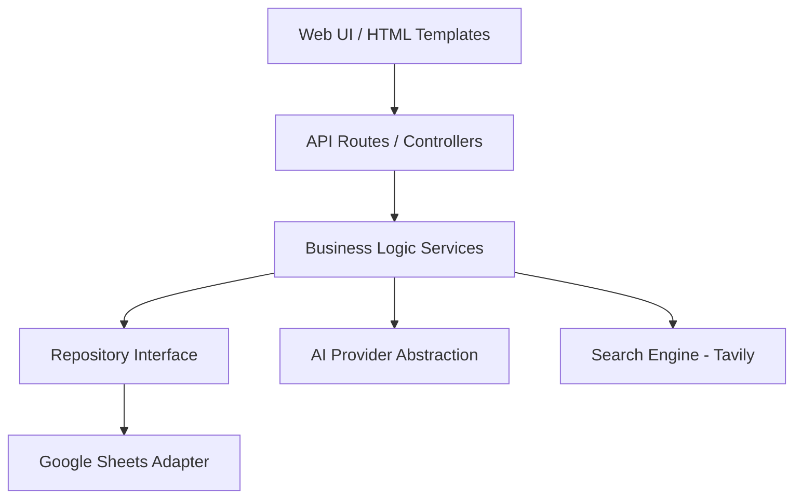

# System Architecture

## Overview
GreenLead follows a layered architecture to separate concerns, ensuring that the initial Google Sheets data layer can be easily swapped out for PostgreSQL in the future.

## Component Diagram


## Backend Framework Decision
The chosen framework is **FastAPI** with **Jinja2** templates, **Pydantic** for schemas, **Pytest** for testing, and **HTTPX** for external API calls.
**Reason:** FastAPI provides high-performance asynchronous request handling natively, which is critical for making parallel external API calls (Tavily, AI providers, Google Sheets). Its native integration with Pydantic ensures rigorous data validation for the structured outputs coming from AI models. Jinja2 handles server-side rendering, keeping the MVP simple without requiring a separate frontend SPA (No React, No Next.js).

## AI Provider Strategy
The architecture uses an abstract `AIProvider` pattern:
```text
AIProvider (Interface)
├── OpenAIProvider
└── GeminiProvider
```
Selection of the specific provider is not hardcoded. The application relies on environment-based configuration:
- `AI_PROVIDER=`
- `OPENAI_API_KEY=`
- `OPENAI_MODEL=`
- `GEMINI_API_KEY=`
- `GEMINI_MODEL=`

## Environments
The architecture supports three distinct environments:
1. **Development**: Local development environment.
2. **Staging**: Pre-production environment for UAT and final testing.
3. **Production**: Live environment for the end-user.
